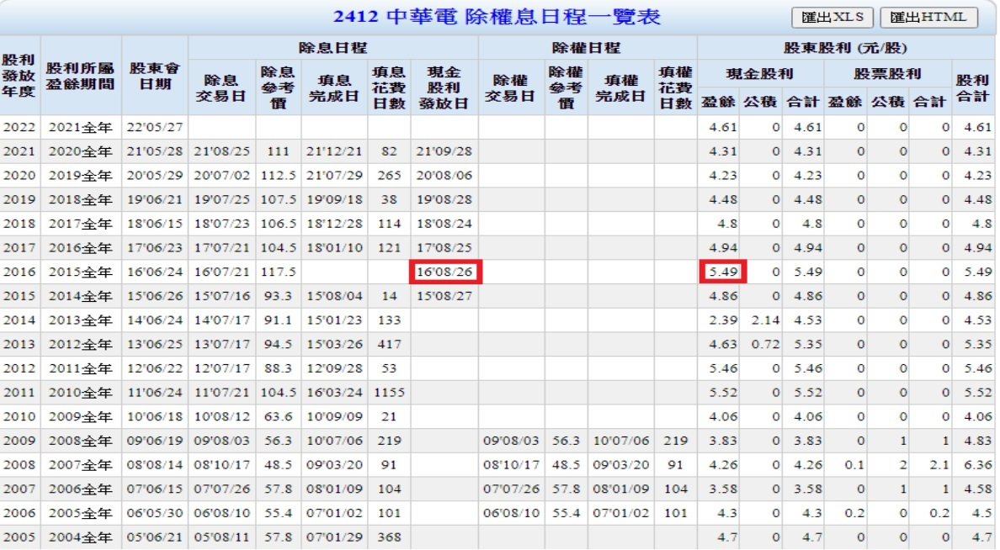
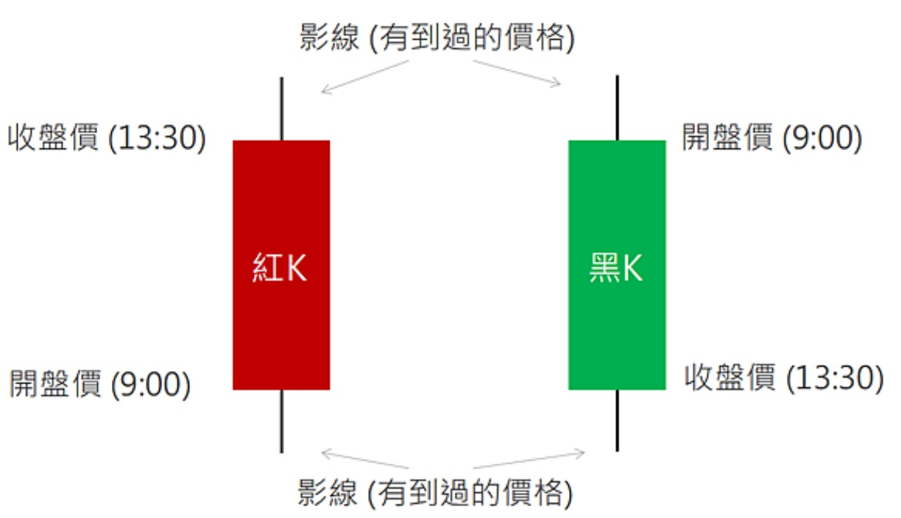
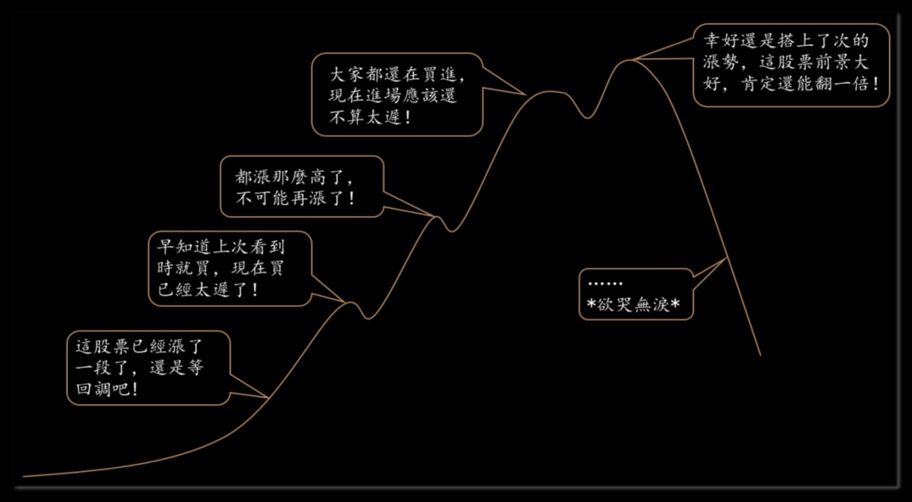

# 認識股票

## 人生就像滾雪球, 只要找到濕雪和一條很長的坡道, 雪球就會愈滾愈大.
## 華倫巴菲特

---

## 金錢的三種用途

### 消費
### 儲蓄
### 投資

---

## 財富陷阱: 五種堅決不碰的偽資產

| 偽資產類型 | 核心概念 |
|:-|:-|
| 頻繁更換的新車 (尤其是豪車) | 立即大幅貶值, 並持續消耗保養, 保險與機會成本,  是財富漏洞. |
| 混合型保險 投資型保單 | 以高額佣金與管理費交換低效率投資,  保險與投資皆做不好. |
| 加密貨幣 | 不產生現金流, 只靠投機接盤者獲利,  長期回報遠遜生產性資產. |
| 主動式管理基金 | 管理費以複利侵蝕成果, 多數長期跑輸指數,  合法卻持續的財富流失. 0050 元大台灣卓越50證券投資信託基金為被動式管理 |
| 長期債券與過度現金 | 在通膨與稅收下實質報酬為負, 形成「有保障的貧困」. |

---

## 股票: 成為一家公司股東的憑證

| 兩個戶頭 | 用途 |
|:-|:-|
| 存款帳戶 | 買(賣)股票時, 用來付錢(收錢) |
| 集保帳戶 | 以電子數位方式存放股票的帳戶 |

---

## 股本: 公司規模大小的指標

股本較大, 常代表著公司已於某一個產業取得領導地位

大型股: 股本大於 300 億. 300 億 / 10 = 30 億股 = 3,000,000 張

建議新手選股方向為大型股. 中小型股, 宜避開電子產業, 原物料, 選擇與在地生活相關的

---

## ETF (Exchange Traded Funds) 指數股票型基金

舉例: 0050 元大台灣卓越50證券投資信託基金

追蹤「臺灣50指數」, 指數由臺灣證券交易所與英國富時指數編制公司合作編制, 成分股是由上市股票中評選出50檔市值最大的上市股票. 一次買進臺灣股市市值最大的50家上市公司, 用小錢投資50檔績優藍籌股, 有效分散個股投資風險. 指數化產品為最簡單易懂的投資工具, 追求長期資本利得之外, 還能享受配息, 持股內容每季調整, 充分掌握產業脈動.

交易方式就像股票一樣

證交稅: 股票是千分之3, ETF 是千分之1

---

## 股票一張 = 1000 股

| 買進 | 賣出 |
|:-|:-|
| 2015/12/28 那天開盤買進一張中華電信 | 2016/2/15 那天開盤將戶頭裡的這張中華電信賣出 |
| 券商會收取 千分之1.425 的手續費 | 券商會收取 千分之1.425 的手續費 |
| | 政府要抽千分之3的證券交易稅(證交稅) |
| 99.5 x (1000 + 1.425) = 99,642 元 | 104 x (1000 - 1.425 - 3) = 103,540 元 |
| 12/29 一張中華電信就會存進你的集保帳戶 | 2/16 一張中華電信就會從你的集保帳戶中移除 |
| 12/30 你的存款帳戶就會扣掉 99,642 元 | 2/17 103,540 元會存入你的存款帳戶 |
| | 交易獲利: 103,540 - 99,642 = 3,898 元 |

---

## 利率

- 股票: 是成為公司股東, 分享公司的獲利
- 存款: 把錢借給銀行賺利息

| 活期存款 | 定期存款 |
|:-|:-|
| 帳戶裡的錢不受限制, 可以隨時提領 | 跟銀行約定一定數量的錢在一段時間內都不提領 |
| 舉例: 活期存款利率 = 0.705% 假設你的銀行帳戶整年平均餘額都在 10 萬左右, 銀行在每年會支付你大約 100,000 x 0.705% = 705 元利息 | 舉例: 定期存款一年期利率 = 1.7% 假設你和銀行約定一筆 10 萬定期存款, 為期一年, 到期銀行會支付你利息 100,000 x 1.7% = 1,700 元利息 |

---

## 股票殖利率

- 2015/12/28 那天開盤買進一張中華電信.
- 2016 那年, 中華電信配發現金股利, 每股 5.49 元.
- 2016/8/26 那天 5.49x1000 = 5,490 現金股利扣掉匯費 10 元, 5,480 就會存到你的存款帳戶.

股票殖利率 = 股利 / 取得成本 x 100% = 5,480 / 99,642 x 100% = 5.5%

| 活期存款 | 定期存款 | 中華電信 |
|:-|:-|:-|
| 0.705% | 1.7% | 5.5% |
| 705 | 1700 | 5,480 |

---

---

## 長期持有

一直到 2022/3, 持有 6 年都沒賣

2016 至 2021 每年配發現金股利: 依序是 5.49 元, 4.94 元, 4.8 元, 4.48 元, 4.23 元, 4.31 元.

- 扣掉 6 次匯費 60 元, 一共領得股利是 28,190 元.

- 如果: 將每年的股利, 在發放那個星期最後的交易日, 收盤後就做零股買進, 可以累積成 1,288 股, 以 2022/3/10 收盤價 123 元計算, 是 158,424 元.

- 如果: 同時加買一張, 累積成 7,928 股, 以 2022/3/10 收盤價 123 元計算, 是 975,144 元
  2022 年, 中華電信配發現金股利每股 4.61 元, 收到股息 36,548 元, 7 年累積第一桶金 100 萬.

---

## 概念 1: 收租

- 租金投報率 = 年租金收入 / 房屋總價 x 100%
- 股票殖利率 = 股利 / 取得成本 x 100%

## 概念 2: 終身免費

每個月要繳 500 多元給中華電信, 一年要 6,000 多, 買兩張中華電信放著, 打電話不用錢, 上網不用錢.

> 投資股票創造被動收入, 支付日常花費, 存下錢再投資股票, 創造更大被動收入.

---

## K 棒

---

## 均線

將過去 N 天的收盤價加總後再除以 N, 得到一個算術平均數值, 每天的結果構成的線就叫移動平均線

5 日線, 10 日線, 月線, 季線, 年線, 10 年線

> 均線和缺口搭配, 判斷股價的走勢, 作為買進賣出的決策依據.

---

## 概念 3: 交易

> 史記 貨殖列傳: 貴上極則反賤, 賤下極則反貴. 貴出如糞土 ,賤取如珠玉, 財幣欲其行如流水

- 看多買進的人, 認為現在股價很便宜, 值得投資.
- 看空賣出的人, 認為現在股價太貴, 應該獲利了結.
- 市場上買賣兩股勢力的強弱, 決定股價上漲或下跌.

> 史記 高祖本紀: 置將不善,一敗塗地.

趨吉避凶, 選對股票, 做好持有股票和現金數量管控.

藉由積小勝為大勝的過程, 大賺小賠的方式, 持續有效地累積資產.

---

## 交易心理和紀律

| 一般投資人 (❌ 錯誤行為) | 正確觀念 (✅ 贏家思維) |
|:-|:-|
| 把賺錢的股票賣掉, 留下虧錢的股票, 特別是虧很多的股票, 乾脆就放著不管, 炒短卻當成長期投資, 把資金部位浪費在無法累積獲利的標的上. (❌ 資金僵固) | 漁船要開到有魚群的地方才有漁獲, 要專注在整體帳戶的價值, 而非單一股票的歷史成本. 讓利潤奔跑, 截斷損失. (✅ 賣掉表現最差, 最有問題的股票, 釋放資金給表現最好的股票) |
| 買到一檔飆股, 只想著股價再漲到多少錢賣掉, 當股價反轉下跌, 當初漲到多少錢時都不賣了, 現在怎麼可以賣, 接著股價繼續跌, 沒關係反正還賺錢繼續拗下去, 接著跌破買進成本, 放著就只能生氣, 失望, 停損就是抱上又抱下, 白忙一場. (❌ 錨定效應) | 用客觀的指標來保障利潤, 而不是用歷史高價來錨定. (✅ 設置移動止損點, 或用技術線型確認趨勢反轉後果斷離場) |
| 在 100 塊買進某一檔股票, 之後連續下跌到 50 塊, (100-50)/100 = 50%, 下跌了 50%. (❌ 虧損計算誤區) | 要再漲 100% 以後, 才能回到原來的價位, (100-50)/50=100%. (✅ 風險管理永遠優先於追求獲利. 應將避免大額虧損作為投資的第一目標) |

---

---

## 交易忠告

- 買賣遭受損失時, 切忌賭徒式加碼, 以謀求攤低成本.

- 要在別人貪婪的時候恐懼, 而在別人恐懼的時候貪婪.

- 如果沒有持有這檔股票 10 年的準備, 那麼連 10 分鐘都不要持有這張股票.

- 交易並不是低買高賣, 實際上是高買更高賣, 是強者更強, 弱者更弱, 是錦上添花, 落井下石.

- 股市贏家不買落後股, 不買平庸股, 全心全力鎖定領導股.
